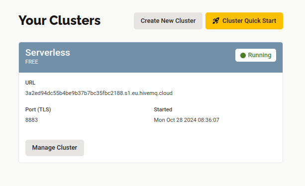
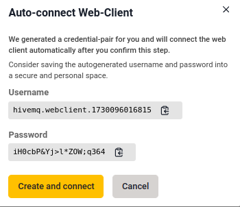
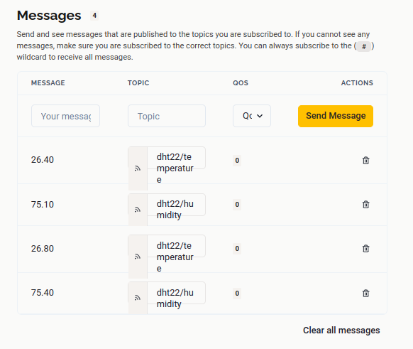

# Practical Example: ESP32 and MQTT Protocol for Sensor Data Transmission

This guide demonstrates how to use an ESP32 with a DHT22 sensor to monitor temperature and humidity and transmit sensor data via MQTT protocol to the HiveMQ broker.

## Table of Contents
1. [Overview](#overview)
2. [Objective](#objective)
3. [Required Components](#required-components)
4. [Instructions](#instructions)
   - 4.1 [Connecting ESP32 to WiFi](#41-connecting-esp32-to-wifi)
   - 4.2 [Programming ESP32 to Read DHT22 Data](#42-programming-esp32-to-read-dht22-data)
   - 4.3 [Publishing Data to HiveMQ via MQTT](#43-publishing-data-to-hivemq-via-mqtt)
5. [Configuring HiveMQ for ESP32 Connection](#configuring-hivemq-for-esp32-connection)
   - 5.1 [Creating a HiveMQ Account and Serverless Cluster](#51-creating-a-hivemq-account-and-serverless-cluster)
   - 5.2 [Cluster Information and MQTT Settings](#52-cluster-information-and-mqtt-settings)
   - 5.3 [Setting Up Web Client and Topic Subscriptions](#53-setting-up-web-client-and-topic-subscriptions)

---

## 1. Overview
This project focuses on using the MQTT protocol to publish temperature and humidity data from an ESP32 device to the HiveMQ broker, enabling remote data access and monitoring.

## 2. Objective
Transmit data from the DHT22 sensor connected to an ESP32 through MQTT to HiveMQ for real-time data monitoring.

## 3. Required Components
- ESP32 development board
- DHT22 temperature and humidity sensor
- MQTT broker account with HiveMQ

## 4. Instructions

### 4.1 Connecting ESP32 to WiFi
Set up the ESP32 with WiFi credentials to establish an internet connection, allowing communication with the HiveMQ broker.

### 4.2 Programming ESP32 to Read DHT22 Data
Program the ESP32 to read temperature and humidity values from the DHT22 sensor, which will be transmitted to HiveMQ.

### 4.3 Publishing Data to HiveMQ via MQTT
Configure the ESP32 code to publish sensor data to HiveMQ via MQTT under specified topics.

## 5. Configuring HiveMQ for ESP32 Connection

### 5.1 Creating a HiveMQ Account and Serverless Cluster

1. Go to [HiveMQ](https://www.hivemq.com/) and click `Start Free`.
2. Under **Get Started with HiveMQ**, select `HiveMQ Cloud` by clicking the `Sign Up Free Now` button.
3. Register for a new account or log in if you already have one.
4. Once authenticated, navigate to the **Select the HiveMQ Cloud plan you need** section.
5. Under the **Serverless (FREE)** option, click `Create Serverless Cluster` to set up a new cluster.
6. After creation, go to **Your Clusters**.

   

7. Click `Manage Cluster` to access the cluster details.

   

### 5.2 Cluster Information and MQTT Settings

- **Overview**: This section contains important cluster (HiveMQ broker) information and connection parameters.
  - **Cluster URL**: The MQTT server URL required in the ESP32 code for broker connection.
  - **Port 8883**: The secure connection port for MQTT server in the ESP32 code.

### 5.3 Setting Up Web Client and Topic Subscriptions

The Web Client offers a testing environment to verify communication between the ESP32 and HiveMQ.

#### Connection Settings
- Configure `Username` and `Password` required for the connection in the ESP32 code.
  - **Options**:
    - Create custom credentials (Username & Password) or
    - Click `connect with autogenerated credentials` for secure, strong credentials.

   

- After entering Username and Password, click `Connect` to establish the broker connection.

   

#### Topic Subscriptions
- To set a topic for publishing data from ESP32:
  - Enter the defined topic from the ESP32 code in the `TOPIC` field and click `Subscribe`. This action sets HiveMQ to listen for data on the subscribed topics and display it in the **Messages** section when data is received.

   

#### Messages
- The **Messages** section provides real-time visualization of the data sent from the ESP32 to HiveMQ through subscribed topics.
- It’s also possible to send a message back to the ESP32 via the defined publish topics by clicking `Send Message`.

   

This setup enables the ESP32 to publish sensor data via MQTT to HiveMQ, allowing remote monitoring and data interaction.
